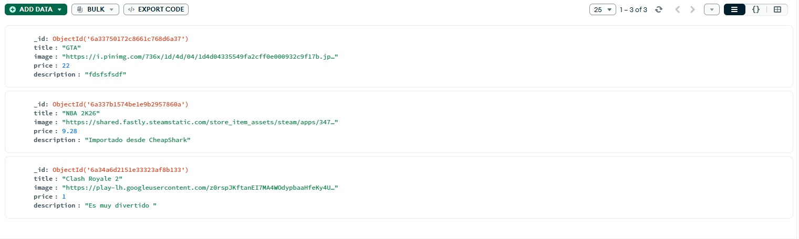
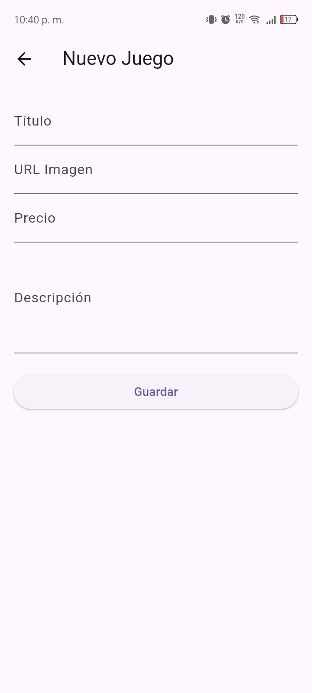
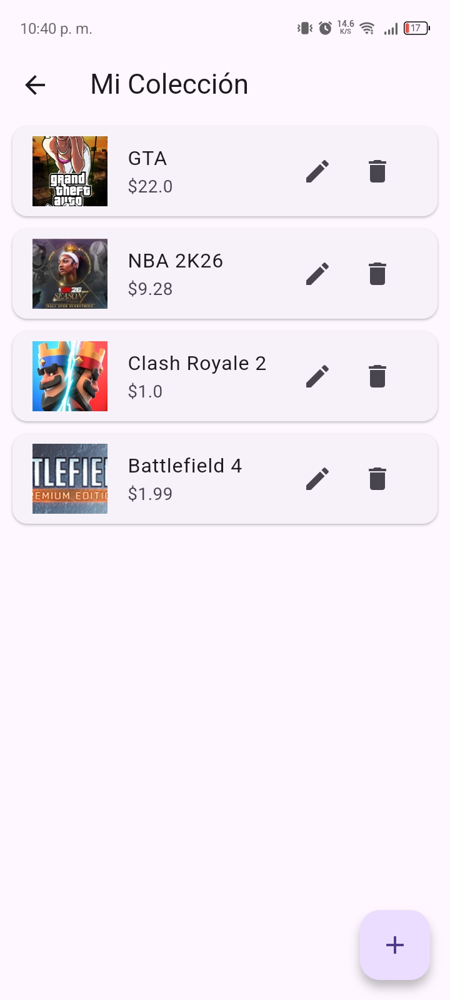
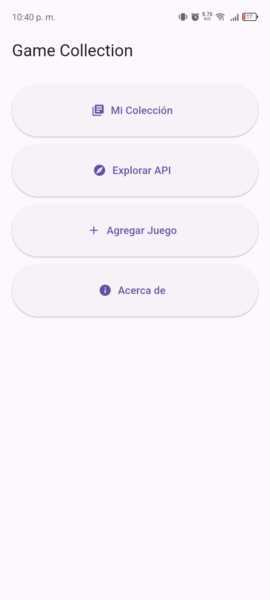
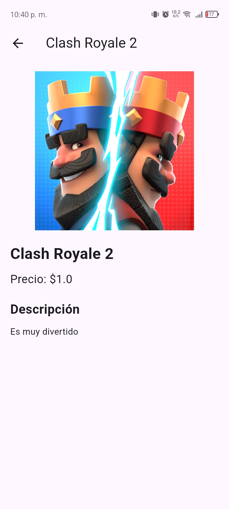
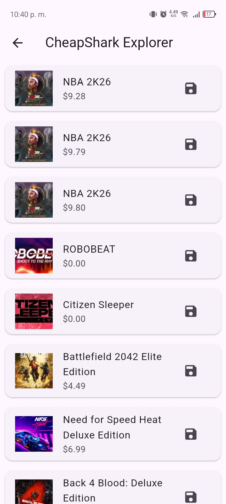
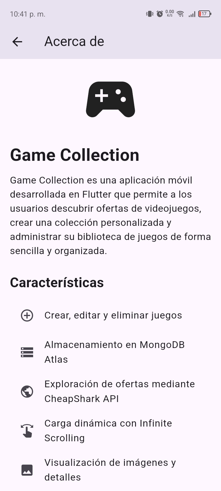

# 🎮 Game Collection App

## Integrantes

* Gabriel Escobar
* Nicolas Chiguano 


---

# Descripción del Proyecto

Game Collection App es una aplicación móvil desarrollada en Flutter que permite a los usuarios gestionar una colección personal de videojuegos y explorar ofertas disponibles mediante una API externa.

La aplicación implementa operaciones CRUD completas conectadas a MongoDB Atlas, consumo de API REST, navegación entre múltiples pantallas e infinite scrolling para la carga dinámica de datos.

---

# Funcionalidades

✅ Crear videojuegos

✅ Consultar videojuegos almacenados

✅ Editar videojuegos

✅ Eliminar videojuegos

✅ Visualizar detalles completos

✅ Consumo de API externa (CheapShark)

✅ Infinite Scrolling

✅ Navegación entre pantallas

---

# Tecnologías Utilizadas

* Flutter
* Dart
* MongoDB Atlas
* CheapShark API
* REST API

---

# API Utilizada

## CheapShark API

Sitio oficial:

https://www.cheapshark.com/

### Endpoint principal

```http
GET https://www.cheapshark.com/api/1.0/deals?pageNumber=0&pageSize=20
```

### Datos obtenidos

* Título del videojuego
* Imagen
* Precio
* Oferta disponible

---

# Base de Datos

## MongoDB Atlas

Colección utilizada:

```text
games
```

Campos almacenados:

```json
{
  "_id": "ObjectId",
  "title": "Nombre del juego",
  "image": "URL imagen",
  "price": 0.0,
  "description": "Descripción"
}
```

---

# Evidencia de MongoDB Atlas

## Registros almacenados



> Insertar aquí una captura de MongoDB Atlas mostrando los registros almacenados.

---

# Capturas de la Aplicación

## HomePage



> Captura de la pantalla principal.

---

## CollectionPage



> Captura de la lista de videojuegos almacenados.

---

## FormPage



> Captura del formulario para crear o editar videojuegos.

---

## DetailPage



> Captura del detalle completo de un videojuego.

---

## ApiExplorerPage



> Captura del consumo de la API CheapShark con infinite scrolling.

---

## AboutPage



> Captura de la pantalla "Acerca de".

---

# Estructura de Navegación

```text
HomePage
│
├── CollectionPage
│     ├── FormPage
│     └── DetailPage
│
├── ApiExplorerPage
│
└── AboutPage
```

---

# Instrucciones de Ejecución

## 1. Clonar el repositorio

```bash
git clone URL_DEL_REPOSITORIO
```

## 2. Instalar dependencias

```bash
flutter pub get
```

## 3. Configurar MongoDB Atlas

Actualizar la cadena de conexión en:

```text
lib/services/mongodb_service.dart
```

con las credenciales correspondientes.

## 4. Ejecutar la aplicación

```bash
flutter run
```

---

# Video Demostrativo

Duración máxima: 3 minutos.

El video debe evidenciar:

* Conexión con MongoDB Atlas.
* Crear videojuego.
* Editar videojuego.
* Eliminar videojuego.
* Visualización de detalles.
* Consumo de API externa.
* Infinite Scrolling.
* Navegación entre pantallas.

---

# Versión

Versión 1.0.0

Proyecto desarrollado en Flutter para demostrar la integración de bases de datos NoSQL, consumo de APIs REST, navegación y gestión de datos mediante operaciones CRUD.
